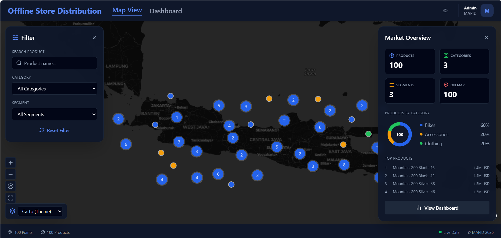
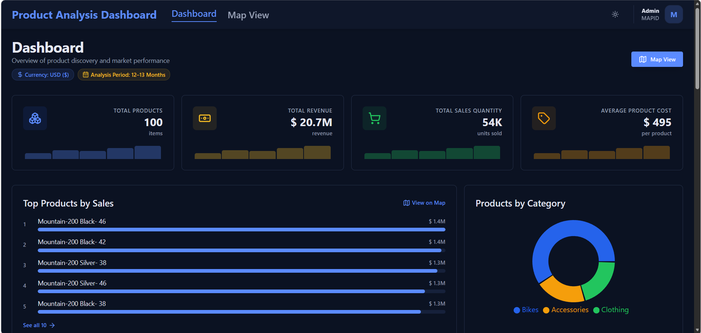
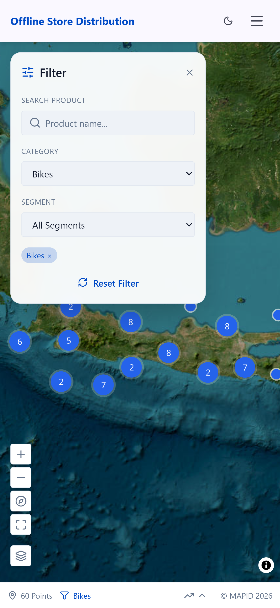

# Product Analysis Dashboard

Dashboard analisis produk: **peta interaktif sebaran produk (WebGIS)** dan
**halaman analytics** berisi KPI, chart, dan tabel produk.

Project ini terdiri dari dua bagian yang berjalan terpisah:

| Bagian | Folder | Peran | Deploy |
|--------|--------|-------|--------|
| **Frontend** | [`frontend/`](./frontend) | UI (peta + analytics) | Cloudflare Workers |
| **Backend** | [`backend/`](./backend) | REST API + database | Railway |

---

## 🖼️ Tampilan

### Map View (WebGIS)
Peta interaktif sebaran produk dengan clustering dan filter.



### Analytics Dashboard
KPI cards, chart distribusi, histogram, dan tabel produk.



### Mobile
Tampilan responsif di perangkat mobile.



---

## 🧩 Tech Stack

**Frontend** — React 19 + TanStack Start (SSR), TypeScript, Vite, TanStack Query,
MapLibre GL JS (peta), Recharts (chart), Tailwind CSS + shadcn/ui.

**Backend** — Node.js + Express, TypeScript, SQLite (better-sqlite3), Zod.

---

## 🚀 Instalasi & Menjalankan

Butuh **Node.js 20+**. Jalankan backend dulu, lalu frontend.

### 1. Backend (`http://localhost:3000`)
```bash
cd backend
npm install
npm run migrate    # buat database + jalankan migrations
npm run seed       # isi sample data (opsional)
npm run dev
```

### 2. Frontend (`http://localhost:5173`)
```bash
cd frontend
npm install
npm run dev
```

> Saat development, request `/api/*` dari frontend otomatis di-*proxy* ke backend,
> jadi tidak perlu set URL backend.

---

## 📚 Dokumentasi Detail

README ini hanya garis besar. Untuk detail lengkap (endpoint API, environment
variables, asumsi data, deployment, troubleshooting), lihat:

- **Frontend:** [`frontend/README.md`](./frontend/README.md) — halaman aplikasi,
  env vars, struktur folder, deployment Cloudflare.
- **Backend:** [`backend/README.md`](./backend/README.md) — 17 endpoint API,
  asumsi data & KPI, CORS, deployment Railway/Docker.
